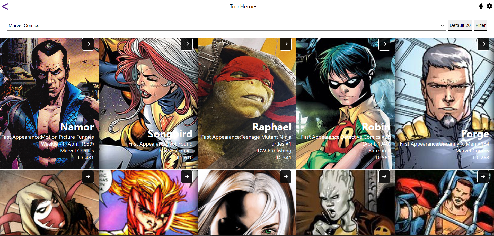
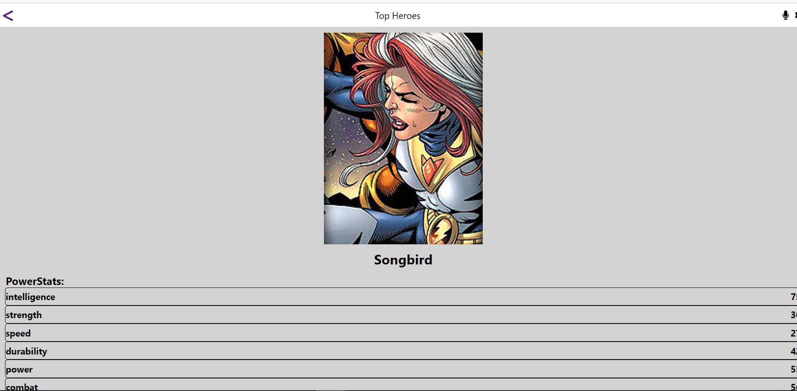
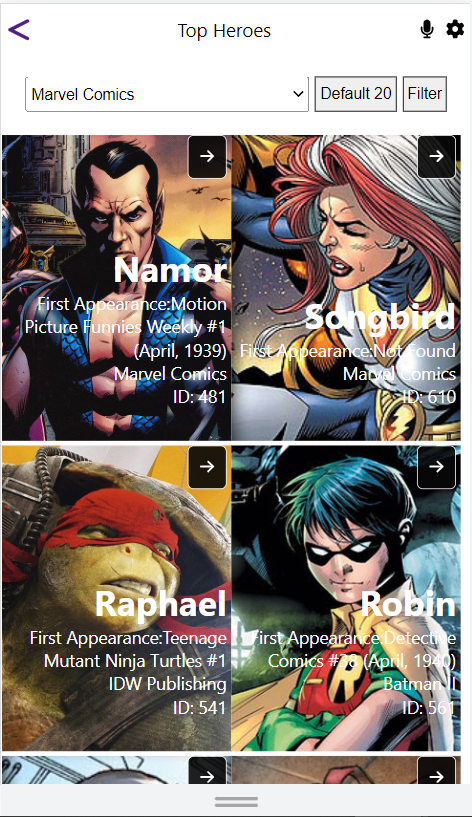
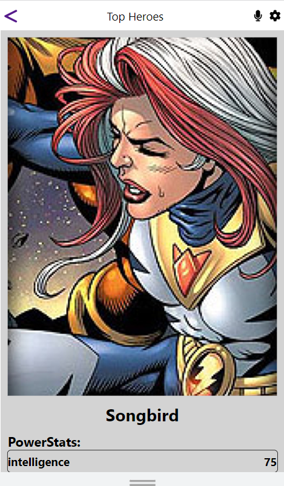

# Super Heroes
In this project I have created a single page application using React and Redux. The application fetches data from an API and displays it on the page. The user can filter the data by name and also get heroes to the movies.

## Built With

- HTML.
- Javascript.
- Css.
- React-Redux.
- Jest.
- React-Bootstrap.

## To get a local copy up and running follow these simple example steps.

- Clone this repo to your machine by using Git clone: Git clone `https://github.com/samiullah997/thired-capstone-project/.git`
- open in your vs code terminal and run live server
- open in your browser
- run `npm i react-app` to install all the dependencies
- run `npm start` to start the server
- run `npm test` to run the test
- run `npm run build` to build the project

### Run the following tests:

To run tests on this project if you tweaked something, run the following command

- `npx hint .`
- `npx stylelint "\*_/_.{css,scss}"`
- `npx eslint .`
- Install jest using `npm i --save-dev jest`
- Install jsDom using `npm install --save-dev jest-environment-jsdom-global jest-environment-jsdom`
- run your test using `npm run test`

### LIVE DEMO

Check the live demo here [Live Demo](https://63409b0245e65f0009327e87--fascinating-pastelito-bbdd20.netlify.app/)

### LIVE VIDEO LINK

Check the live demo here [Video Links](https://www.loom.com/share/d138d8d6ca024989ae684e59c1b8680c)

## Authors

👤 **Sami Ullah**

- GitHub: [@githubhandle](https://github.com/samiullah997)
- Twitter: [@twitterhandle](https://twitter.com/samiullahk997)
- LinkedIn: [LinkedIn](https://www.linkedin.com/in/samiullah-khan-2702b7171/)

## 🤝 Contributing

Contributions, issues, and feature requests are welcome!

Feel free to check the [issues page](https://github.com/samiullah997/thired-capstone-project//issues).

## Show your support

Give a ⭐️ if you like this project!

## Acknowledgments

- Hat tip to anyone whose code was used
- Inspiration
- Microverse
- Nelson Sakwa
- Ballhead App
- Attribution CC (Creative Commons)
- etc

## 📝 License

This project is licensed by [MIT](./LICENSE).
